### `01 / WHOAMI`

> **Brandon** 
> Cybersecurity student at **China University of Mining and Technology (CUMT)**.

### `02 / CURIOSITIES`

Cybersecurity · Computer Science · Blockchain · Prediction Markets · Economics

I like exploring ideas across disciplines — from how secure systems are built, to how markets behave, and how technology develops within a broader historical context.

### `03 / CTF & CODE`

I play **CTFs**, mostly around **MISC** and **WEB**.

**Languages**

### `04 / OUTSIDE THE SCREEN`

-  **Photography** — landscapes, streets, and places worth remembering
-  **Football** -  
-  **Poker** — Texas Hold'em

### `05 / CONNECT`

I'm especially interested in **prediction markets** and always open to research discussions, exchanging ideas, or meeting people working on similar questions.

If you're researching prediction markets — or simply have an interesting idea to discuss — feel free to reach out.

personal space · version 01
